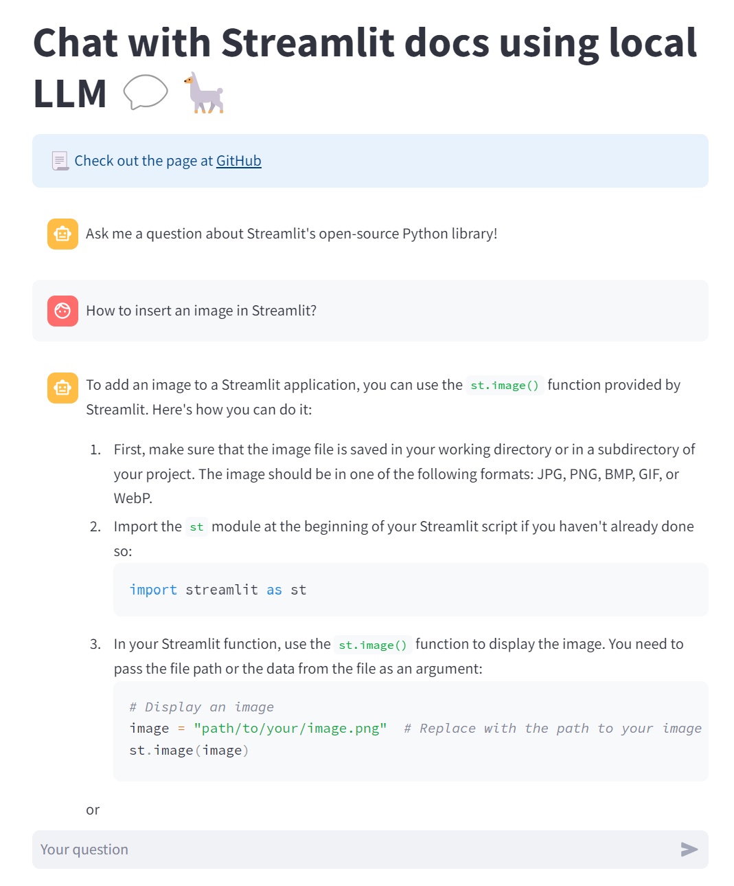

# 🦙📚 Chat with Streamlit Docs Using Local LLM

Code base: https://github.com/carolinedlu/llamaindex-chat-with-streamlit-docs/tree/main 
Build a chatbot powered by local LLM with the contents of the Streamlit docs (or your own data).

Embeddding model: BAAI/bge-small-en-v1.5 (HuggingFace) 
Local LLM: Mistral 7b (Ollama)

## Overview of the App

- Takes user queries via Streamlit's `st.chat_input` and displays both user queries and model responses with `st.chat_message`
- Uses LlamaIndex to load and index data and create a chat engine that will retrieve context from that data to respond to each user query

## Preparation
1. Install packages Ollama (https://ollama.com/).
2. Open the terminal and launch Ollama serve by executing "ollama serve".
3. Open another terminal and download the model Mistral by running "ollama pull mistral:instruct".
4. Install other packages by running "pip install -r requirement.txt".
5. You may encounter an error with Optimum (1.16.2) of 'KeyError: 'last_hidden_state''. You can fix this error by following the modifications outlined here: [https://github.com/huggingface/optimum/pull/1674/files].

## Try out the app
Run the app by executing "streamlit run streamlit_app.py". 
Once the app is loaded, enter your question about the Streamlit library and wait for a response.

